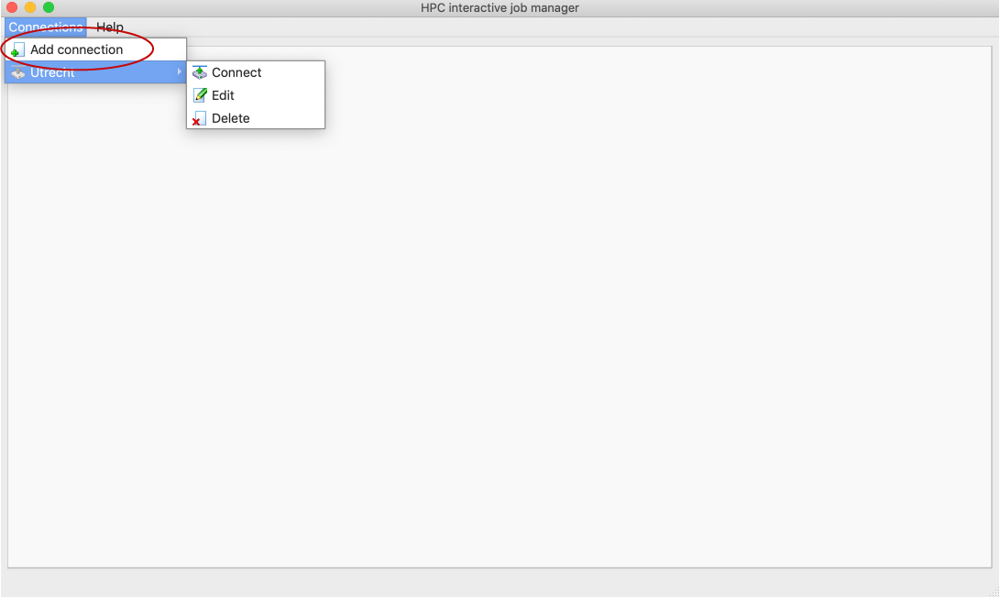
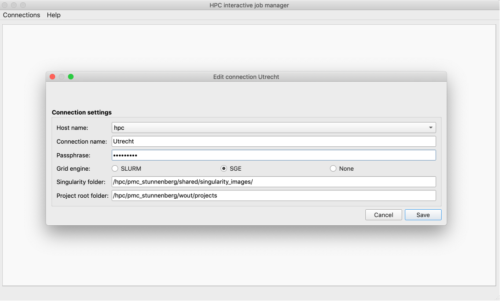
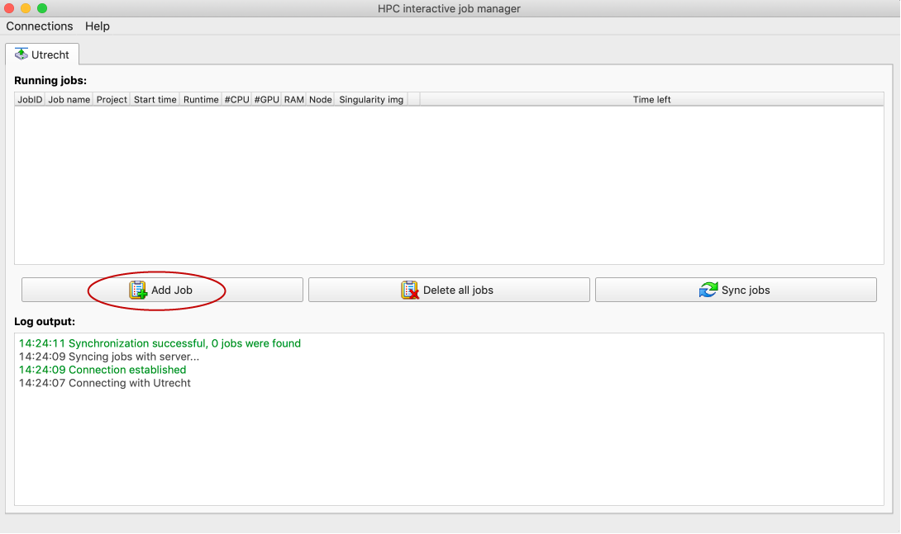
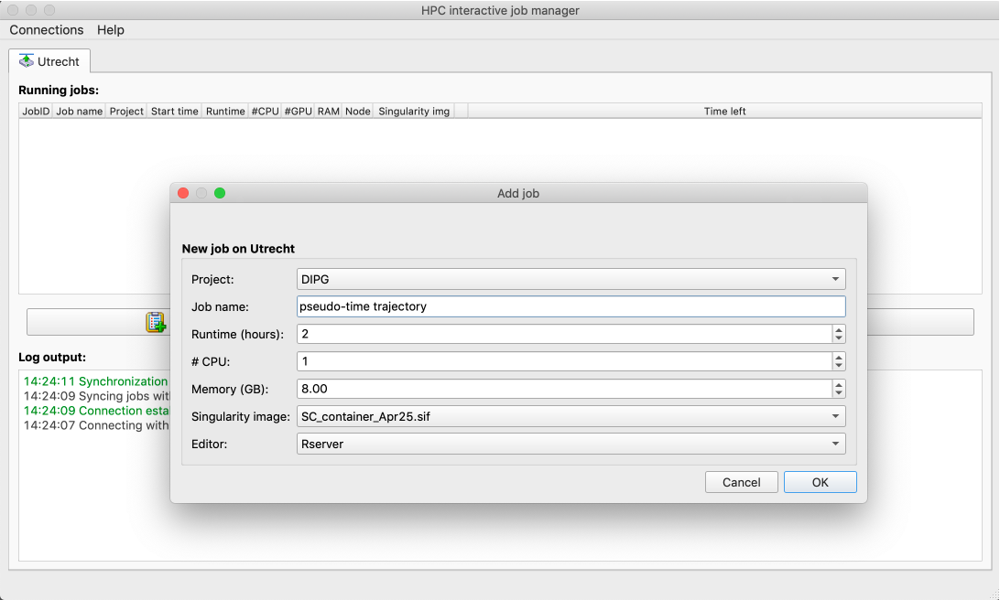
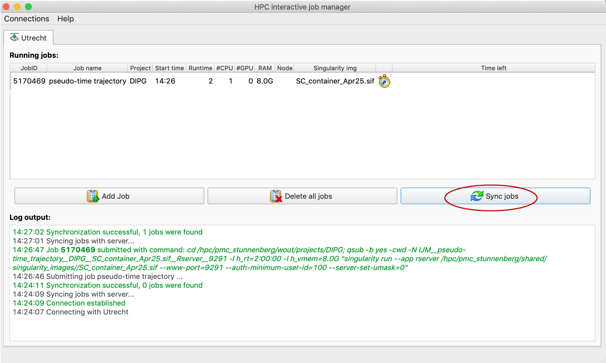
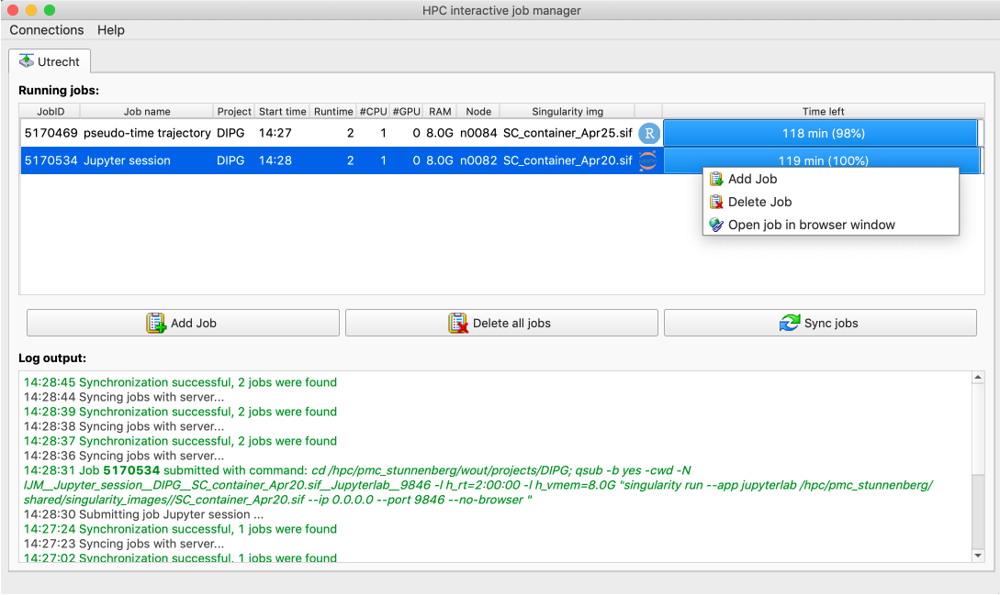

# About GratiSSH
The _GRAphical Tool for Interactive Scientfic Scripting on HPC (GratiSSH)_ makes it easy to run an interactive Rstudio server or JupyterLab environment on a remote Linux server. GratiSSH was designed to work with HPCs that run the popular [SLURM](https://slurm.schedmd.com/documentation.html) or [SGE](https://en.wikipedia.org/wiki/Oracle_Grid_Engine) job scheduling manager, but can run on Linux servers without job scheduling system.

GratiSSH is written in Python and uses the PyQt5 graphical environment. Under the hood, GratiSSH connects to a [singularity container](https://sylabs.io/docs/) that is stored on the remote server. This singularity container has [Rstudio](https://rstudio.com), [Rstudio server](https://rstudio.com/products/rstudio/#rstudio-server), [JupyterLab](https://jupyterlab.readthedocs.io/en/stable/) and many R-packages tailored to single cell analysis, such as [Seurat](https://satijalab.org/seurat/) and [Monocle3](https://cole-trapnell-lab.github.io/monocle3) pre-installed. The same singularity environment can be used to run batch jobs or on a local computer, using the same compute stack of R, Rstudio, JupyterLab and all installed packages.

GratiSSH is based on [Tito Candelli's RRS](https://github.com/Slacanch/RRS), but provides an improved user interface (at least i.m.o.). Furthermore, GratiSSH is designed to manage connections with multiple remote servers in parallel and can connect to Linux systems running SLURM, SGE or a no job scheduling system. GratiSSH has been tested on Mac OSX and Ubuntu Linux. Pre-combined binaries are available under "releases". 

__Of note__, the current version can only connect to a single server that runs SGE. It also lacks many of the desired features, but these are scheduled to be implemented within the near future.

# Setting up your SSH config
GratiSSH uses the connections defined in your `~/.ssh/config` file. If you did not define a connection to your HPC yet, type `open -a TextEdit ~/.ssh/config` (Mac OSX). Insert the following text, change the YOUR_HPC_USERNAME to your HPC username and save the changes.

```{r, eval = F, echo = T}
Host hpc
  HostName hpcs04.op.umcutrecht.nl
  User YOUR_HPC_USERNAME
  ProxyCommand ssh -i ~/.ssh/id_rsa_hpc -l YOUR_HPC_USERNAME hpcgw.op.umcutrecht.nl nc %h %p 2>/dev/null
  IdentityFile ~/.ssh/id_rsa_hpc

Host *
  AddKeysToAgent yes
  UseKeychain yes
```

## Making and sending the RSA key
To be able to connect from outside the Princess Maxima Center, the HPC administrators must add your RSA key to the system. If you do not have access to the HPC yet, generate a key using the following commands:

```{r, eval = F, echo = T}
cd ~/.ssh
ssh-keygen -t rsa -C HPC -f id_rsa_hpc
```
Provide a __strong passphrase (and remember it, you will need it later)__. Type `ls -ltrh` and there should be a `id_rsa_hpc.pub` file. Send this file as an attachment to: hpc-systems@lists.umcutrecht.nl

Usually, the adminstrators respond the same working day. If the administrator has added your key. You can now login using: `ssh hpc`. You will need to provide the password twice; once for login to the HPC gateway and once for login to the submit node. You will get tired of this very rapidly and more so, the interactive R-studio solution below will not work. Let's create a passwordless login.

Log out of the HPC and type the following in a terminal on your __local__ PC/macbook:
```{r, eval = F, echo = T}
cd ~/.ssh
ssh-copy-id -i ~/.ssh/id_rsa_hpc hpc
```
where *hpc* is the hostname you defined in your ~/.ssh/config file. Now login again using `ssh hpc`. If all went well, no password will be asked.

## Configuring singularity
By default, only your _home directory_ and _current working directory_ are bound by singularity. This means that you cannot access files in other folders. This can by changed by setting the __SINGULARITY_BIND__ variable in your `~/.bashrc` file. 

* Type `vim ~/.bashrc` and add the line `export SINGULARITY_BIND="/hpc/pmc_stunnenberg,/home/wmegchelenbrink`. Subdirectories of these paths will also become available. Change "wmegchelenbrink" to your own user name and save the changes. 

# Getting GratiSSH
## Downloading the latest release build
- Download the [latest release](https://github.com/wmegchel/GratiSSH/releases) under 'assets';
- Double click the downloaded program;
- If you're working on a PMC Macbook, you cannot access files from an untrusted source by just double clicking, but can still open the program from a terminal; 
- Open a terminal and go to the directory where you saved GratiSSH;
- Run the app by typing:

```{r, eval = F, echo = T}
chmod 755 GratiSSH_v001_alpha_MACOSX
./GratiSSH_v001_alpha_MACOSX
```
- The program should now start

## Building GratiSSH from source
todo
<!-- - Clone the Github repository -->
<!-- - Python3 -->
<!-- - PyQt5 -->
<!-- - tinydb -->
<!-- - paramiko -->
<!-- - @todo: how to install using pip3 or conda -->

# Working with GratiSSH
## Adding/Editing a connection
First we need to add a new connection. 

* Click `connection` -> `Add connection`



A new window is shown where you can define the preferences for your new job.

* Select the `host name` you want to connect to from the dropdown menu. These host names are taken from the `~/.ssh/config` file. If your host is not in this menu, add it to the  `~/.ssh/config` file;
* Provide a `connection name`, this can be any name;
* Provide the `passphrase` you defined for your ssh key. If you did not provide any key, leave this field blank;
* Choose `grid engine` is `SGE`. Others are not implemented yet;
* Set the path to the singularity files. These are stored at `/hpc/pmc_stunnenberg/shared/singularity_images`;
* Set the folder where your projects are stored. For me this is `/hpc/pmc_stunnenberg/wout/projects`;
* Click `save`.



### Connecting with the HPC host
Now that our connection is ready, we want to connect to the host. 

* Click `connection` -> `your connection name` -> `connect`
* If the connection is OK, the program will connect to the server and synchronize your jobs;



### Adding a new job
Now it is time to submit a new job. 

* Click `add job`;
* Select the project you want to work on. These are the subfolders defined in the project folder you selected above.
* Type a suitable job name;
* Select the `runtime`, `number of CPUs` and `memory` required for your job;
* Select the `singularity image` you want to use for the job;
* Select `RServer` as the editor; 
* Click `OK`.



The job will be added to the list with a "stopwatch" symbol, indicating that it is scheduled, but not yet running. This status will be updated automatically every 10 mins, but we can do this manually using the `sync jobs` button. 

* Click the `sync jobs` button every 20s until the job status changes. If the job is running a blue bar with remaining compute time will be shown;



* When the job is running, right click on your job and select `Open job in browser window`
* A new tab will open in your browser with `Rserver`.
* You can delete a job by right clicking the job and seelcting `Delete job`;
* You can delete all running jobs by clicking the `Delete all jobs` button;

__NB: Jobs will keep running when you close GratiSSH, make sure you delete running jobs that are not needed any more, because compute time will be deduced from our budget.__ You can close the program and re-attach running jobs after re-opening `GratiSSH` with the `sync jobs` button. Jobs that were not started from `GratiSSH`, e.g. a mapping job, will not be opened in this program.



## Configuring Jupyter Labs
If you prefer to work in *Jupyter labs*, you need to configure a security password first. The simplest way of doing this is running jupyter labs from the singularity image. Since singularity is only installed on the compute nodes and not on the submission nodes, we need to connect to a compute node first. Follow these steps:

* Open a terminal and connect to the HPC;
* Type `qlogin -l h_rt=2:00:00 -l h_vmem=8.0G` and provide your password. 
* Now you should be on a compute node, indicated by a terminal prompt with <your_username>@n00XXX;
* Type: `singularity exec /hpc/pmc_stunnenberg/shared/singularity_images/SC_container_Apr25.sif jupyter notebook password`, this may take a few seconds;
* Provide your jupyter password, this will be hashed and stored in `~/.jupyter/jupyter_notebook_config.json`;
* Now you can start a new job and select `Jupyter labs` as your preferred editor. When you open the job in a browser window, you will be prompted for the password you just set.

# Running Rscripts in batch mode
Using the singularity container, you can also run Rscripts in batch mode. This is both convenient and good practice, because you are using the exact same environment with the same R-packages and versions that you use for the interactive jobs defined above. As an example, we will run an R-script that normalizes some Celseq2 data and plots a TSNE, UMAP and a small heatmap with cluster marker genes.

__TODO: download from github!__
```{r, eval = F, echo = T}
singularity exec ~/ownCloud/sing_test/SC_container_Apr25.sif Rscript example_TSNE_UMAP_Heatmap.R
```

# Using singularity and Rstudio or JupterLab on your Macbook
Having established an Rstudio environment that works interactively and in batch mode on the HPC, we would like to use the same environment on our Macbook as well. This is possible and highly recommended. First, we need to install singularity.

* Activate the `30 min admin` in the self serivce app;
* Download singularity desktop at: `https://sylabs.io/singularity-desktop-macos/` and follow the installation instructions;
* If installation is finished, open a termimal and type `singularity`. If all went well, a list with options should appear.
* Copy the singularity image from the hpc: `scp hpc:/hpc/pmc_stunnenberg/shared/singularity_images/SC_container_Apr25.sif .`
* For Rstudio, type `singularity run --nv --app rstudio SC_container_Apr25.sif`
* For JupterLab, type `singularity run --nv --app jupyterlab SC_container_Apr25.sif`

# Listing the applications
`singularity inspect --list-apps SC_container_Apr25.sif`

# TODO
1 update the images with red circles
2 add stuff to github

- add support for SLURM and "native linux"
- installing additional packages
- add todo from the HPC_main_ui
